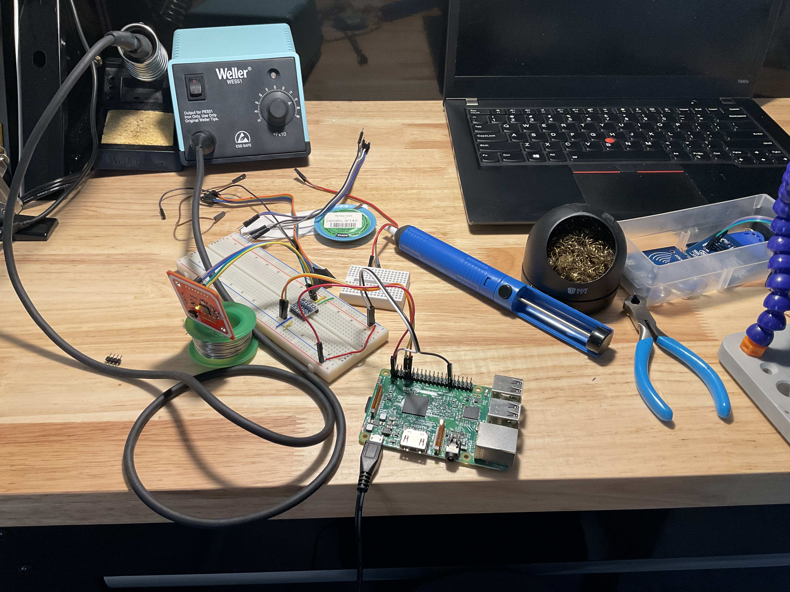
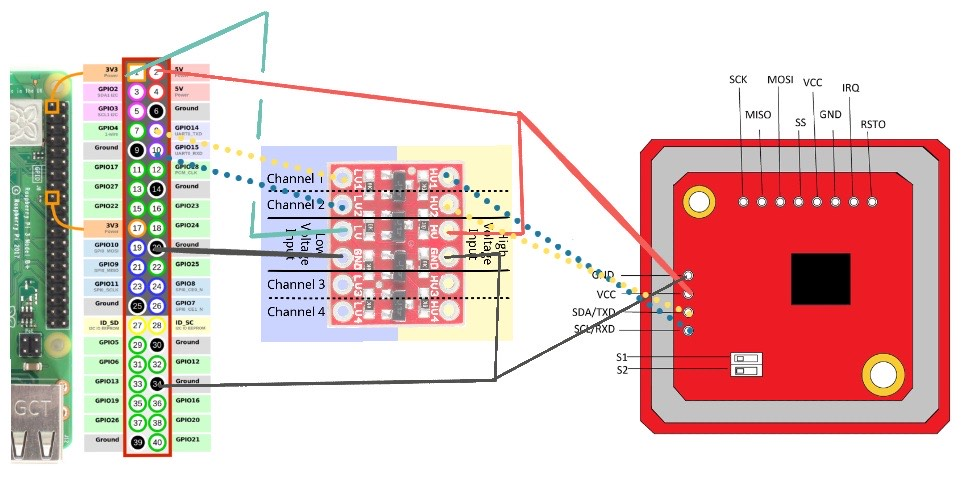

# golang NFC Test

This was a test to get the `PN532` chip found on a lot of low cost NFC readers out there working with the Raspberry Pi - and then getting it to work with GoLang. This is a test project to test feasability for a future project.

This documentation has links to what information I found useful and how I got various libraries installed.

## Enable serial port on Raspberry Pi 

```
sudo raspi-config
```

Then go to `Interface Options` -> `Serial Port`
Disable login shell and enable serial port hardware.

## Install nfclib-1.8.0

```
wget https://github.com/nfc-tools/libnfc/releases/download/libnfc-1.8.0/libnfc-1.8.0.tar.bz2
tar -xvjf libnfc-1.8.0.tar.bz2
cd libnfc-1.8.0.tar.bz2
sudo mkdir /etc/nfc
sudo mkdir /etc/nfc/devices.d
sudo vim /etc/nfc/devices.d/pn532_uart_on_rpi.conf
```

For the `pn532_uart_on_rpi.conf` set the following:

```
name = "PN532 board via UART"
connstring = pn532_uart:/dev/ttyS0
allow_intrusive_scan = true
```

**Important Note**: The serial port `/dev/ttyS0` would be `/dev/ttyAMA0` on Raspberry Pi's older than the 3 or with Zero's - on the 3+ `/dev/ttyAMA0` is used by the Bluetooth hardware, meaning a lot of documentation and default examples will fail as its pointing to a different serial port. 

The rest follows the Adafruit installation guide [here](https://learn.adafruit.com/adafruit-nfc-rfid-on-raspberry-pi/building-libnfc):

```
sudo apt-get install autoconf
sudo apt-get install libtool
sudo apt-get install libpcsclite-dev libusb-dev
autoreconf -vis
./configure --with-drivers=pn532_uart --sysconfdir=/etc --prefix=/usr
sudo make clean
sudo make install all
```

You can test if it's working (and if your hardware is connected) via `nfc-list` or `nfc-poll`. `nfc-list --version` will tell you what version of nfc-lib you are currently using. Ensure that it's `1.8.0`.

## Connecting the hardware
The `PN532` board I had needed 5V for its power so I used a level shifter in order to facilitate communication between the Pi and the NFC Chip. See the quick ugly diagram below for wiring:



## Go Example
I utilized [clausecker's nfc module](https://github.com/clausecker/nfc) for go. The example code for a quick nfc scan is in `main.go`